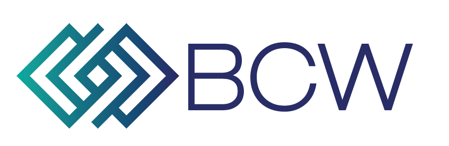

<div align="center">
    <p>
        
    </p>
    <p>
        Transforming the DLT Ecosystem
    </p>
</div>

# Take Home Test (Web3/Frontend)

## Overview

This is a take-home test for candidates applying for a frontend developer
position at BCW Technologies. It contains a single section named "Frontend" involving React and Typescript.

Feel free to solve the assignment however you see fit, using whatever coding
style or third-party libraries you think are appropriate. A boilerplate has been provided to you, which you can simply `npm i && npm run start`.

To start the test, simply clone this repo and make your edits locally. Once you are done, please push your changes to this repo and create a pull request.

NOTE: We expect more than one commit in the PR, do not spend time overthinking the commit messages or squashing your commits together.

## Assignment

This assignment relies on the use of MetaMask, so please ensure that you have a fundamental understanding of Web3 and MetaMask.

There are 5 UI states we'd like to add:

1. Connect to MetaMask 

    1a. Do not autoconnect with the user's MetaMask, please ensure this is an `onClick` event

    

2. Initializing

    2a. This is the connection step where the app waits for the user to unlock their MetaMask

    

3. Reload

    3a. For example, if a user is on an unsupported network, a `Reload` button should be displayed (maybe with a helpful message?)

    3b. The `onClick` event should simply reload the page

    

4. Display the connected account's balance (based on the selected network in MetaMask) and the their wallet address

    4a. Minimum requirements: support for `ethereum` and `matic-network`

    

    4b. To test and ensure the correct balance is displayed, we recommend that you use the respective test networks and use faucets to increase your balance

    _You can quickly add testnets by visiting https://mumbai.polygonscan.com/, https://testnet.bscscan.com/, and other Etherscan blockexplorer products, scroll to the bottom of the screen, and click on the "Add {asset} Network" button._

    

    4c. Your balance should automatically update when the balance in your wallet address increases or decreases

5. Clicking the balance displays the balance in an approximate USD value.
   
    5a. You can retrieve the approximate USD value of the asset using the API information described below. 

    

    5b. A mapping of `chainId`s and their respective `string` values has been created under `src/constants/chainIdMap.ts`, which you may help you when you make the API query.

    5c. The type definitions of the API response has been created under `src/types/coinstats.ts`, which may help you with your API response.

### Tips

- Please make the app be served on port `:3000`.

- **Please use React-Typescript for this task**, but feel free to structure the code however you prefer and use any other third-party libraries at your discretion. 

- Aesthetics and precision are important, please put some effort in doing so and ensure that the button you create matches the image examples above. Some microinteractions or animations would be appreciated.

- Feel free to be creative! The button is the only functional element, paint a canvas as you see fit.

### API Information

- **CoinStats Public API `GET /public/v1/coins` endpoint:** 

    - https://api.coinstats.app/public/v1/coins/{asset}?currency=USD

- **Parameters:**

    - `asset`: `string` - one of `ethereum`, `matic-network`, `binance-coin`

- **Example:**

    - `curl --location --request GET 'https://api.coinstats.app/public/v1/coins/ethereum?currency=USD'`

    - Sample Response:
        ```
        {
            "coin": {
                "id": "ethereum",
                "icon": "https://static.coinstats.app/coins/EthereumOCjgD.png",
                "name": "Ethereum",
                "symbol": "ETH",
                "rank": 2,
                "price": 4235.092539415802,
                "priceBtc": 0.0709123529071697,
                "volume": 24152580981.918007,
                "marketCap": 501393319614.98785,
                "availableSupply": 118390168.5615,
                "totalSupply": 0,
                "priceChange1h": 0.96,
                "priceChange1d": 0.39,
                "priceChange1w": -10.47,
                "websiteUrl": "https://www.ethereum.org/",
                "twitterUrl": "https://twitter.com/ethereum",
                "contractAddress": "0x2170ed0880ac9a755fd29b2688956bd959f933f8",
                "decimals": 18,
                "exp": [
                    "https://etherscan.io/",
                    "https://ethplorer.io/",
                    "https://blockchair.com/ethereum",
                    "https://eth.tokenview.com/",
                    "https://hecoinfo.com/token/0x64ff637fb478863b7468bc97d30a5bf3a428a1fd"
                ]
            }
        }
      ```


## Theming Properties (optional)

- `#2D84EB`
- `rgba(45,132,235,0.1)`
- `#D50066`
- `rgba(213,0,102,0.1)`
- `#000`
- `#FFF`
- `border-radius: 12px`
- `box-shadow: 0px 2px 2px 0px rgba(0, 0, 0, 0.25);`
- `font-family: Inter, -apple-system, 'Segoe UI', Roboto, Arial, Helvetica, sans-serif;`


## Submitting Your Code

Once you've completed the test, please send a pull request to the same repository.

**Do not include node_modules or .git in your submission. A `.gitignore` has already been added to help you.**

We will then review it and get back to you as soon as possible.

Thanks!